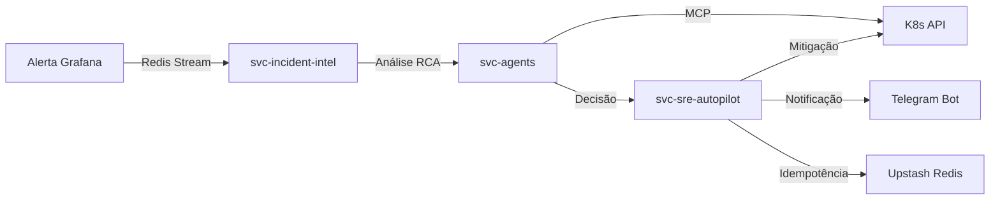
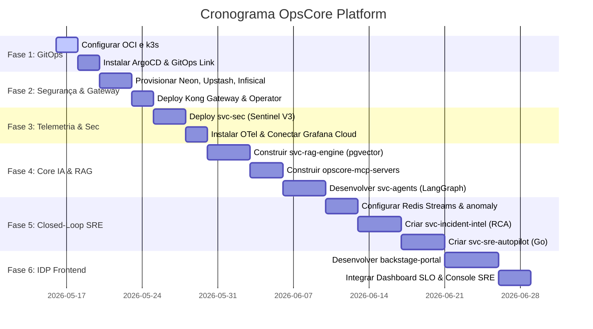

# OpsCore Platform v2 — Arquitetura Final & Guia de Engenharia

A **OpsCore Platform v2** é uma plataforma interna de engenharia (IDP) e inteligência artificial (AIOps), projetada para automação de Engenharia de Confiabilidade (SRE) e governança de segurança baseada em eventos. A arquitetura foi estruturada para garantir resiliência, escalabilidade e conformidade estrita aos princípios de **Zero Trust**, operando sob um modelo de custo otimizado (R$ 0,00 contínuo) por meio de serviços serverless e instâncias de computação gratuitas de elite.

---

## Quick Links

| Recurso | Link |
|:---|:---|
| Organização GitHub | [opscore-platform](https://github.com/opscore-platform) |
| Diagrama de Arquitetura | [Ver Topologia](#1-topologia-de-arquitetura-lógica) |
| Stack Tecnológica | [Ver Stack](#2-stack-tecnológica-de-elite-foco-em-portfólio--finops) |
| Limites Free Tier | [Ver Tabela](#3-limites-free-tier--estratégias-de-controle) |
| Cronograma | [Ver Gantt](#7-cronograma-de-execução-e-deploy) |

---

## Status dos Repositórios

Esta tabela reflete o estado atual de implementação de cada repositório. Atualizada manualmente a cada sprint.

| Repositório | Finalidade | Status | Cobertura de Testes |
|:---|:---|:---:|:---:|
| `opscore-docs` | ADRs, Runbooks e Documentação Central | 🟢 Pronto | N/A |
| `opscore-infra` | IaC Terraform (OCI, Neon, Upstash) | 🔵 Planejado | N/A |
| `opscore-k8s` | GitOps: ArgoCD, Helm, Policies, Dashboards | 🔵 Planejado | N/A |
| `opscore-platform-libs` | Pacotes compartilhados (Logs, OTel) | 🔵 Planejado | — |
| `opscore-gha-workflows` | CI/CD reutilizável + ARM64 Build | 🔵 Planejado | N/A |
| `backstage-portal` | IDP Unificado (Next.js, 6 pilares) | 🔵 Planejado | — |
| `svc-gateway` | Kong Gateway (JWT, mTLS, Rate Limit) | 🔵 Planejado | — |
| `svc-rag-engine` | FastAPI + pgvector (ingestão e consulta) | 🔵 Planejado | — |
| `svc-agents` | Orquestrador IA (LangGraph + MCP) | 🔵 Planejado | — |
| `svc-sec` | Sentinel V3 como microsserviço | 🔵 Planejado | — |
| `svc-incident-intel` | Detecção de anomalias + RCA | 🔵 Planejado | — |
| `svc-sre-autopilot` | Autopilot em Go (K8s auto-healing) | 🔵 Planejado | — |
| `opscore-mcp-servers` | Servidores MCP (GitHub, Grafana, K8s, AWS) | 🔵 Planejado | N/A |

> **Legenda:** 🟢 Pronto em produção — 🟡 Em desenvolvimento (Beta) — 🔵 Planejado (próximo sprint)

---

## 1. Topologia de Arquitetura Lógica

```plaintext
[ CLIENTES / USUÁRIOS ]
  ├── Dev / Tech Lead (Acesso via backstage-portal na Vercel)
  ├── SRE (Acesso via painel de operações integrado ao backstage-portal)
  └── CI/CD & Sentinel V3 (Acesso via APIs diretas e Webhooks)
          │
          ▼
[ CAMADA DE BORDA E SEGURANÇA ]
  └── svc-gateway (Kong Gateway)
       ├── Validação JWT & Rate Limiting
       ├── Terminação TLS e roteamento mTLS interno
       └── Infisical Secrets Operator (Injeta credenciais nos pods)
          │
          ▼
[ CAMADA DE MICROSSERVIÇOS (k3s na Oracle Cloud ARM - 24GB RAM) ]
  ├── svc-rag-engine (Python/FastAPI) ──────▶ Consulta Vetores (Neon.tech)
  ├── svc-agents (Python/LangGraph)   ──────▶ Orquestra LLMs (Groq/Gemini) + Consulta MCP
  ├── svc-sre-autopilot (Go)          ──────▶ Executa mitigações via K8s API & Actions
  ├── svc-sec (Sentinel V3)           ──────▶ Valida regras de segurança no tráfego
  └── svc-incident-intel (Python)     ──────▶ Analisa anomalias e gera RCA (Telegram Bot)
          │
          ▼
[ SERVIDORES DE CONTEXTO (MCP) ]
  └── opscore-mcp-servers (Integrações isoladas fornecendo contexto para a IA)
       ├── GitHub MCP (Lê PRs, commits, issues)
       ├── Grafana MCP (Lê métricas de SLOs e alertas)
       ├── K8s MCP (Lê status de pods, logs)
       └── AWS MCP (Lê status de instâncias/recursos)
          │
          ▼
[ CAMADA DE DADOS E MENSAGERIA (Serverless Cloud) ]
  ├── Upstash Redis (Cache, Sessões, Estado LangGraph, Pub/Sub & Streams)
  └── Neon.tech (PostgreSQL relacional + extensão pgvector)
          │
          ▼
[ OBSERVABILIDADE CENTRAL ]
  └── Grafana Cloud (Prometheus/Métricas, Loki/Logs, Tempo/Traces) via OpenTelemetry
```

### Fluxo de Dados — Closed-Loop SRE



---

## 2. Stack Tecnológica de Elite (Foco em Portfólio & FinOps)

Para impressionar a liderança técnica de grandes empresas de tecnologia, a arquitetura mescla um cluster central robusto com serviços serverless de alta performance. Isso descentraliza o processamento, protege o cluster contra estouro de memória e garante custos operacionais nulos de forma contínua.

### A. Computação, Orquestração e GitOps

*   **Hospedagem do Cluster (Oracle Cloud OCI Always Free - ARM Ampere)**
    *   *O Serviço:* Instância de computação dedicada utilizando arquitetura ARM Ampere, fornecendo gratuitamente **4 OCPUs e 24 GB de RAM** vitalícios (recurso total compartilhável entre instâncias).
    *   *O Peso no Portfólio:* Demonstra maturidade ao fugir de instâncias minúsculas de testes (como t2.micro da AWS que expiram em um ano). O cluster `k3s` opera folgado, permitindo rodar todos os microsserviços e o gateway de forma estável.
*   **Esteira de Entrega Declarativa (GitHub Actions + ArgoCD GitOps)**
    *   *O Serviço:* O GitHub Actions cuida do CI (Build/Test) de forma automatizada e o ArgoCD atua dentro do cluster sincronizando o estado desejado.
    *   *O Peso no Portfólio:* Eleva o projeto ao padrão das Big Techs. Prova domínio absoluto sobre a cultura **GitOps**, onde qualquer alteração nos manifestos de infraestrutura gera um deploy automático e seguro no Kubernetes.

### B. IDP Unificado (backstage-portal — Next.js)

Embora o Backstage oficial do Spotify seja uma excelente ferramenta, ele é extremamente pesado para rodar em clusters gratuitos (consome entre 1 GB e 2 GB de RAM ocioso) e complexo de estender com lógicas de IA sem o uso de dependências TypeScript legadas.

Por isso, o **`backstage-portal`** foi projetado como um **IDP (Internal Developer Platform) customizado e leve usando Next.js**, hospedado na **Vercel** (consumo zero de RAM do cluster OCI). Ele implementa os pilares de um IDP de elite em um **frontend unificado**:

1.  **Software Catalog:** Interface visual que consolida os repositórios, metadados de ownership (CODEOWNERS) e status de SLOs em tempo real.
2.  **Docs Vivas (RAG Explorer):** Conecta diretamente ao `svc-rag-engine` para buscar ADRs, postmortems e guias via busca semântica em linguagem natural.
3.  **API Explorer (Kong Gateway Integration):** Console interativo agregador para que desenvolvedores testem os endpoints de toda a malha de microsserviços.
4.  **IA SRE Chatbot (Agente Inteligente):** Interface de chat acoplada ao `svc-agents` para permitir diagnóstico e análise de logs/deploys via chat ("*Por que o serviço RAG caiu ontem às 14h?*").
5.  **Dashboard SLO (Métricas):** Painel de métricas e indicadores de confiabilidade integrado via Grafana Cloud APIs.
6.  **Console de Operações SRE:** Interface de controle para visualização de incidentes, aprovações de mitigação e histórico de atuações do Autopilot.

> **Decisão arquitetural:** Consolidar Dashboard, Console de Operações e Portal de Desenvolvimento em um único frontend elimina fragmentação, reduz custos de hospedagem e garante que cada rota tenha implementação completa e funcional.

### C. Dados, Cache e Mensageria (Serverless Descentralizado)

*   **Banco de Dados & Vetores (Neon.tech - Postgres Serverless + pgvector)**
    *   *O Serviço:* Armazenamento serverless de alto desempenho com suporte nativo para buscas vetoriais usando pgvector.
    *   *O Peso no Portfólio:* Prova conhecimentos avançados de **FinOps**, pois o banco escala até zero quando está inativo, otimizando custos e mantendo uma excelente experiência de desenvolvimento baseada em ramificações (*database branching*).
*   **Cache, Sessões e Mensageria Leve (Upstash Redis com Streams)**
    *   *O Serviço:* Redis serverless de latência ultrabaixa para persistência rápida de cache, estados e comunicação assíncrona via **Redis Streams** (substitui Kafka na fase MVP).
    *   *O Peso no Portfólio:* Demonstra capacidade de escolher a ferramenta certa para o contexto. Redis Streams oferece semântica de consumer groups e persistência de mensagens equivalente ao Kafka para workloads de baixo volume, sem adicionar outro serviço externo. A migração para Apache Kafka está prevista no roadmap de escala de produção.

### D. Segurança e Governança Corporativa

*   **Gerenciamento de Segredos (Infisical Cloud + Secrets Operator)**
    *   *O Serviço:* Cofre corporativo centralizado para gerenciamento seguro de tokens e segredos em microsserviços.
    *   *O Peso no Portfólio:* Prova que o projeto não possui segredos hardcoded e segue as regras de conformidade corporativa. O operador nativo converte chaves em segredos do Kubernetes sem intervenção manual.
*   **Segurança de Tráfego e Autenticação (Kong API Gateway + Sentinel V3)**
    *   *O Serviço:* Gateway de alta performance para validação estrita de tokens JWT, roteamento mTLS e integração com o Sentinel V3 para escanear pacotes em tempo real.
    *   *O Peso no Portfólio:* Demonstra a implementação real de arquitetura **Zero Trust**, onde nenhum serviço interno confia em outro sem validação criptográfica.

### E. Observabilidade e Inteligência Artificial (AIOps)

*   **Telemetria Centralizada (Grafana Cloud - LGTM Stack)**
    *   *O Serviço:* Plataforma de observabilidade completa integrando Prometheus (Métricas), Loki (Logs) e Tempo (Traces distribuídos).
    *   *O Peso no Portfólio:* O uso de OpenTelemetry Collector enviando dados de telemetria distribuída para o Grafana Cloud representa o estado da arte de SRE, permitindo rastrear gargalos em tempo real entre microsserviços Python e Go.
*   **Modelos de Linguagem Híbridos (Groq API + Google AI Studio)**
    *   *O Serviço:* Inferência em tempo real via Groq (Llama 3.3 70B) aliada a embeddings estruturais com o Google Gemini.
    *   *O Peso no Portfólio:* Valida a capacidade de desenhar sistemas agênticos multi-modelo resilientes, com alta velocidade de resposta e fallbacks automáticos em caso de indisponibilidade de APIs.

---

## 3. Limites Free Tier & Estratégias de Controle

Operar com custo zero exige conhecimento preciso dos limites de cada provedor. A tabela abaixo consolida os limites reais e as estratégias adotadas para não estourá-los:

| Serviço | Limite Free Tier | Risco Principal | Mitigação Adotada |
|:---|:---|:---|:---|
| **Oracle Cloud (OCI)** | 4 OCPUs, 24 GB RAM (Always Free) | Recurso dividido se criar múltiplas instâncias | Instância única com k3s concentrado |
| **Upstash Redis** | 10.000 comandos/dia | Cache + sessões + pub/sub podem esgotar | Batching de comandos, TTL agressivo em cache, debounce de 10s em alertas |
| **Neon.tech** | 0.5 GB storage, 191h compute/mês | Vetores pgvector 768d consomem storage rápido | Limitação do corpus de documentos, poda periódica de embeddings antigos |
| **Groq API** | 30 req/min, 14.400 req/dia | Agente com múltiplas chamadas encadeadas pode travar | Rate limiter no svc-agents, cache de respostas frequentes no Redis |
| **Google AI Studio** | 1.500 req/dia (embeddings) | Ingestão em lote de documentos pode esgotar | Processamento em lote com fila interna, re-embedding apenas de docs alterados |
| **Grafana Cloud** | 10.000 métricas/mês | 5 microsserviços com OTel podem estourar | Filtragem seletiva de métricas no OTel Collector, envio apenas de métricas de SLO |
| **Vercel** | 100 GB bandwidth, serverless functions | Cold start em funções Edge | SSG para páginas estáticas, ISR para dados dinâmicos |
| **Infisical** | 5 projetos, membros ilimitados | Sem risco significativo para portfólio solo | N/A |
| **GitHub Actions** | 2.000 min/mês (free) | Builds multiplataforma ARM64 são mais lentos | Cache de layers Docker, builds condicionais por path filter |

---

## 4. Regras de Otimização e Confiabilidade da Arquitetura

Para garantir que o ecossistema opere perfeitamente no ambiente real gratuito, aplicamos as seguintes políticas:

1.  **Proteção contra Estouros de Redis (Batching & Debounce):** O `svc-sec` e os webhooks de alerta agrupam mensagens em lotes de 10 segundos antes de publicar no Redis Streams, evitando estouros dos limites gratuitos em caso de tempestade de alertas.
2.  **Implantação de Servidores MCP em Sidecar (Stdio):** Servidores MCP locais (K8s, GitHub) rodam como contêineres sidecar ao lado do `svc-agents` no mesmo pod. Isso evita expor portas na internet pública e elimina custos de latência e rede.
3.  **Circuit Breaker no Autopilot (Go):** Se o Autopilot falhar na mitigação de um SLO em 3 tentativas seguidas no intervalo de 10 minutos, o sistema trava as atuações automáticas (`LOCKED`) e notifica o Telegram para intervenção manual com aprovação (*Human-in-the-Loop*).
4.  **Alinhamento de pgvector:** A tabela vetorial do Neon.tech é dimensionada estritamente para suportar o formato do Gemini `text-embedding-004` (768 dimensões). Caso um modelo local HuggingFace seja ativado via feature flag, ele utiliza um transformador ou coluna paralela dedicada.
5.  **cert-manager + Let's Encrypt:** Integrado no repositório de GitOps para automação total de TLS no gateway público da Oracle Cloud.

---

## 5. Armadilhas Técnicas & Engenharia de Prevenção (Gargalos Práticos)

Implementar uma infraestrutura complexa com ferramentas gratuitas exige antecipar potenciais falhas de ambiente. Abaixo estão os desafios técnicos críticos mapeados e as respectivas estratégias adotadas no OpsCore Platform para resolvê-los antes de codificar:

### A. O Paradoxo do ARM64 (Incompatibilidade OCI vs. GitHub Actions)
*   **O Desafio:** A Oracle Cloud Always Free funciona exclusivamente em processadores com arquitetura **ARM Ampere (aarch64)**. No entanto, as máquinas do GitHub Actions, por padrão, executam tarefas e compilam pacotes em arquitetura **x86_64**.
*   **O Risco:** Se as imagens Docker forem geradas sob x86_64 padrão e enviadas ao Kubernetes da OCI, os Pods ficarão travados em estado `CrashLoopBackOff` com a mensagem de erro fatal: `exec format error`.
*   **A Prevenção:** Centralizar nos workflows reutilizáveis (`opscore-gha-workflows`) a ativação do **Docker Buildx** integrado com o emulador **QEMU**, garantindo o empacotamento multiplataforma com alvo absoluto em `linux/arm64`.

### B. Esgotamento de Conexões (Pool Limit no Serverless DB)
*   **O Desafio:** A camada gratuita do Neon.tech (Postgres) possui restrições agressivas sobre a quantidade máxima de conexões TCP abertas concorrentes.
*   **O Risco:** Microsserviços que abrem e fecham conexões em cada requisição de API (especialmente em Python FastAPI no `svc-rag-engine` e `svc-agents`) esgotarão o limite do pool rapidamente, resultando em timeouts gerais.
*   **A Prevenção:**
    *   *Neon:* Utilização forçada de **Connection Pooling (PgBouncer)** ativado por padrão na própria URL de conexão fornecida pela Neon.
    *   *Redis:* Implementação de padrões de projeto **Singleton** nos inicializadores das aplicações Python e Go, garantindo que conexões TCP sejam persistentes e reutilizadas entre as chamadas de funções.

### C. Duplicidade de Eventos (Idempotência no SRE Autopilot)
*   **O Desafio:** Devido à entrega de mensagens do tipo *at-least-once* (pelo menos uma vez) no Redis Streams, instabilidades de rede podem fazer com que eventos de mitigação sejam entregues em duplicidade.
*   **O Risco:** Se o `svc-sre-autopilot` (escrito em Go) executar o mesmo comando de mitigação mais de uma vez (como um rollout rollback ou scale down de pod), ele pode causar gargalos ou loops catastróficos no Kubernetes.
*   **A Prevenção:** O Autopilot adota idempotência absoluta. Ao receber um evento de atuação, ele calcula o hash do ID do incidente e valida sua existência no Upstash Redis com expiração rápida (ex: 5 segundos). Se o hash já constar no cache, a execução duplicada é ignorada.

### D. Fadiga de Gerenciamento do Polyrepo
*   **O Desafio:** Manter repositórios isolados é essencial para simular a governança das Big Techs, mas atualizar dependências compartilhadas (como `opscore-platform-libs`) nos demais microsserviços manualmente é improdutivo.
*   **A Prevenção:** Instalação e configuração global do **Dependabot** (ou Renovate Bot) na GitHub Organization. Ele monitora novas tags de build geradas nos pacotes e abre automaticamente Pull Requests de sincronização de dependências nos demais microsserviços.

---

## 6. Estrutura de Repositórios

O ecossistema é mantido sob uma estrutura **Polyrepo** sob a organização [opscore-platform](https://github.com/opscore-platform):

```plaintext
opscore-platform/
├── opscore-docs             # Repositório central de ADRs, Runbooks e Documentações
├── opscore-infra            # IaC (Terraform) para Neon, Upstash e OCI
├── opscore-k8s              # GitOps do Cluster (ArgoCD, Helm Charts, Policies OPA, Dashboards as Code)
├── opscore-platform-libs    # Pacotes compartilhados (Python Structlog/OTel & TS Pino)
├── opscore-gha-workflows    # Workflows reutilizáveis de GitHub Actions (inc. SLO Gate & ARM64 Build)
├── backstage-portal         # IDP Unificado (Catálogo, Dashboard SLO, Console SRE, Chat IA — Next.js na Vercel)
├── svc-gateway              # Configurações declarativas do Kong Gateway
├── svc-rag-engine           # FastAPI + pgvector para ingestão e consulta de documentos
├── svc-agents               # Orquestrador de IA (LangGraph + MCP Clients)
├── svc-sec                  # Core de segurança Sentinel V3 como microsserviço
├── svc-incident-intel       # Consumidor Redis Streams para detecção de anomalias e RCA
├── svc-sre-autopilot        # Autopilot em Go para mitigação automática em K8s
└── opscore-mcp-servers      # Servidores MCP unificados (GitHub, Grafana, K8s, AWS)
```

> **Nota sobre consolidação:** Políticas OPA e dashboards de observabilidade vivem dentro de `opscore-k8s` como subpastas (`policies/` e `observability/`). Os 4 servidores MCP foram unificados em `opscore-mcp-servers` com subpastas dedicadas por integração. Os 3 frontends originais foram consolidados em rotas do `backstage-portal`. Essa abordagem garante que cada repositório contenha código funcional real, eliminando repositórios superficiais.

---

## 7. Cronograma de Execução e Deploy

